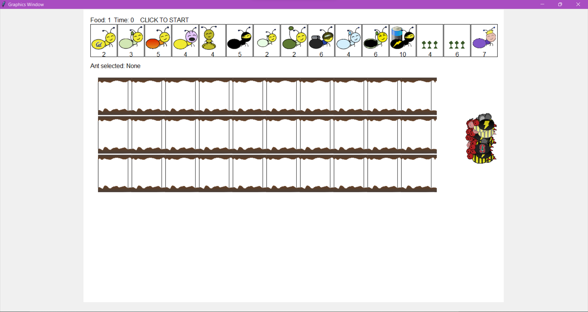
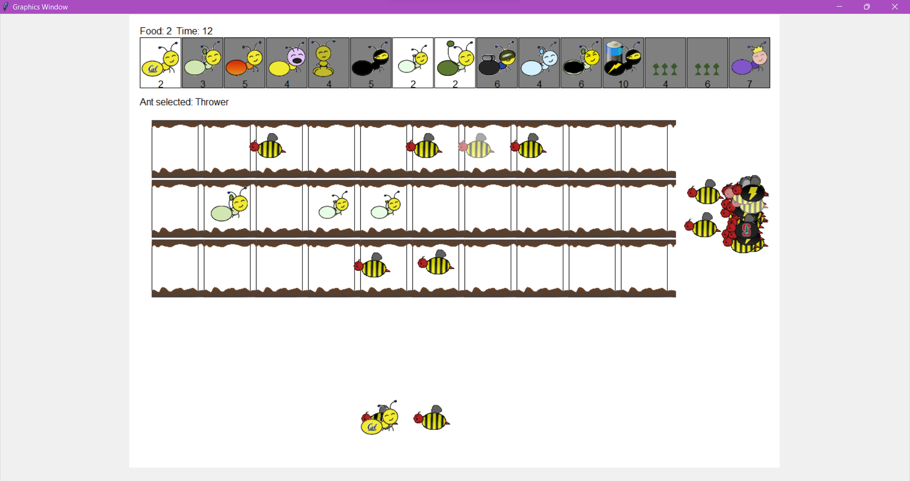
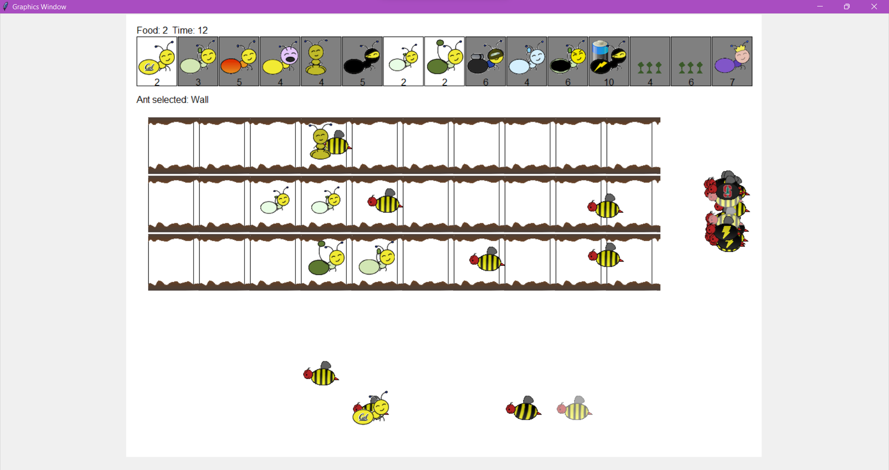

# ants
💻 Source Code for Berkeley's CS61A Ants vs SomeBees project 

The course was not taken as part of Berkeley University's curriculum but rather self-undertaken as a skill enhancement course.

## 🎮 About the game
The project is a tower defense game in which the user deploys Ants to protect the *Ant queen* from attacking bees.
User can deploy different types of ants like Harvester Ant, Thrower Ant(Long / Short / Scuba), Fire Ant, Hungry Ant, Wall Ant. Some generate food, 
some decrease the strength of bees.

## How to play
### Option 1:
Double click `ants_gui.exe` to directly start the game.

### Option 2:
Clone the repository and run command `python3 ants_gui.py` or `python ants_gui.py` to start the game.

## Screenshots
Initial game state

Game play

